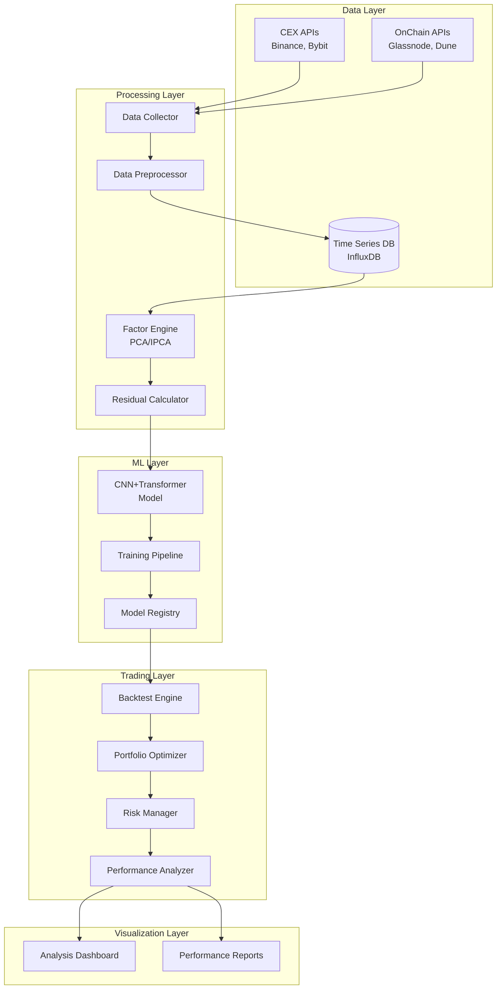

# Design Document

## Overview

Crypto-DLSA Bot은 Guijarro-Ordonez 등의 "Deep Learning Statistical Arbitrage" 논문을 기반으로 한 암호화폐 시장 특화 통계적 차익거래 시스템입니다. 이 시스템은 세 가지 핵심 단계로 구성됩니다:

1. **잔차 포트폴리오 구성**: 조건부 잠재 자산 가격 팩터를 통해 유사 자산들의 차익거래 포트폴리오를 구성
2. **시계열 신호 추출**: CNN+Transformer 아키텍처를 사용하여 시계열 신호를 추출
3. **최적 거래 정책**: 제약 조건 하에서 리스크 조정 수익률을 극대화하는 거래 정책 수립

## Architecture

### 시스템 아키텍처 다이어그램



### 마이크로서비스 아키텍처

시스템은 다음과 같은 독립적인 서비스들로 구성됩니다:

- **Data Service**: 데이터 수집 및 전처리
- **Factor Service**: 팩터 모델 계산 및 잔차 생성
- **ML Service**: 딥러닝 모델 학습 및 추론
- **Backtest Service**: 백테스팅 및 성과 분석
- **API Gateway**: 서비스 간 통신 및 외부 인터페이스

## Components and Interfaces

### 1. Data Collection Module

**책임**: 외부 데이터 소스로부터 암호화폐 시장 데이터 수집

**주요 컴포넌트**:
- `CEXDataCollector`: 중앙화 거래소 API 클라이언트
- `OnChainDataCollector`: 온체인 데이터 API 클라이언트
- `DataValidator`: 데이터 품질 검증
- `DataNormalizer`: 데이터 정규화 및 표준화

**인터페이스**:
```python
class DataCollectorInterface:
    def collect_ohlcv(self, symbols: List[str], timeframe: str, 
                      start_date: datetime, end_date: datetime) -> pd.DataFrame
    def collect_onchain_metrics(self, metrics: List[str], 
                               start_date: datetime, end_date: datetime) -> pd.DataFrame
    def validate_data(self, data: pd.DataFrame) -> bool
    def normalize_data(self, data: pd.DataFrame) -> pd.DataFrame
```

### 2. Factor Engine Module

**책임**: 암호화폐 시장 팩터 계산 및 잔차 포트폴리오 생성

**주요 컴포넌트**:
- `CryptoFactorCalculator`: 암호화폐 특화 팩터 계산
- `IPCAFactorModel`: Kelly, Pruitt, Su (2017) IPCA 라이브러리 기반 팩터 모델
- `PCAFactorModel`: 주성분 분석 기반 팩터 모델 (백업용)
- `ResidualCalculator`: 잔차 계산 및 롤링 윈도우 처리

**팩터 정의**:
- **Market Factor**: 시장 전체 수익률
- **Size Factor**: 시가총액 기반 팩터
- **NVT Ratio Factor**: Network Value to Transaction 비율
- **Momentum Factor**: 가격 모멘텀 팩터
- **Volatility Factor**: 변동성 팩터

**인터페이스**:
```python
class FactorEngineInterface:
    def calculate_market_factors(self, price_data: pd.DataFrame) -> pd.DataFrame
    def fit_ipca_model(self, returns: pd.DataFrame, 
                      characteristics: pd.DataFrame) -> InstrumentedPCA
    def calculate_residuals(self, model: InstrumentedPCA, 
                           returns: pd.DataFrame, 
                           characteristics: pd.DataFrame) -> pd.DataFrame
```

### 3. Deep Learning Engine

**책임**: CNN+Transformer 모델을 통한 시계열 신호 추출

**아키텍처 설계**:
```python
class CNNTransformerModel(nn.Module):
    def __init__(self, input_dim: int, seq_length: int, 
                 num_assets: int, hidden_dim: int = 256):
        super().__init__()
        # CNN 레이어: 로컬 패턴 추출
        self.conv1d_layers = nn.Sequential(
            nn.Conv1d(input_dim, 64, kernel_size=3, padding=1),
            nn.ReLU(),
            nn.Conv1d(64, 128, kernel_size=3, padding=1),
            nn.ReLU(),
            nn.Conv1d(128, hidden_dim, kernel_size=3, padding=1)
        )
        
        # Transformer 레이어: 장기 의존성 모델링
        encoder_layer = nn.TransformerEncoderLayer(
            d_model=hidden_dim, nhead=8, dim_feedforward=512
        )
        self.transformer = nn.TransformerEncoder(encoder_layer, num_layers=6)
        
        # 출력 레이어: 포트폴리오 가중치 생성
        self.output_layer = nn.Linear(hidden_dim, num_assets)
        self.softmax = nn.Softmax(dim=-1)
    
    def forward(self, x):
        # x shape: (batch_size, seq_length, input_dim)
        x = x.transpose(1, 2)  # (batch_size, input_dim, seq_length)
        x = self.conv1d_layers(x)  # CNN 특징 추출
        x = x.transpose(1, 2)  # (batch_size, seq_length, hidden_dim)
        x = self.transformer(x)  # Transformer 처리
        x = x.mean(dim=1)  # 시퀀스 평균
        weights = self.softmax(self.output_layer(x))  # 포트폴리오 가중치
        return weights
```

**커스텀 손실 함수**:
```python
class SharpeRatioLoss(nn.Module):
    def __init__(self, risk_free_rate: float = 0.0):
        super().__init__()
        self.risk_free_rate = risk_free_rate
    
    def forward(self, weights: torch.Tensor, returns: torch.Tensor) -> torch.Tensor:
        portfolio_returns = torch.sum(weights * returns, dim=1)
        excess_returns = portfolio_returns - self.risk_free_rate
        sharpe_ratio = torch.mean(excess_returns) / torch.std(excess_returns)
        return -sharpe_ratio  # 음수로 변환하여 최대화를 최소화 문제로 변환
```

### 4. Backtesting Engine

**책임**: 현실적인 거래 비용을 고려한 전략 성과 시뮬레이션

**주요 컴포넌트**:
- `PortfolioSimulator`: 포트폴리오 시뮬레이션
- `TransactionCostModel`: 거래 비용 모델링
- `RiskMetricsCalculator`: 리스크 지표 계산
- `PerformanceReporter`: 성과 리포트 생성

**거래 비용 모델**:
```python
class TransactionCostModel:
    def __init__(self, 
                 trading_fee_rate: float = 0.001,  # 0.1% 거래 수수료
                 slippage_rate: float = 0.0005,    # 0.05% 슬리피지
                 gas_cost_usd: float = 5.0):       # $5 가스비
        self.trading_fee_rate = trading_fee_rate
        self.slippage_rate = slippage_rate
        self.gas_cost_usd = gas_cost_usd
    
    def calculate_cost(self, trade_value: float, is_onchain: bool = False) -> float:
        cost = trade_value * (self.trading_fee_rate + self.slippage_rate)
        if is_onchain:
            cost += self.gas_cost_usd
        return cost
```

## Data Models

### 1. 시계열 데이터 스키마

```python
@dataclass
class OHLCVData:
    timestamp: datetime
    symbol: str
    open: float
    high: float
    low: float
    close: float
    volume: float
    
@dataclass
class OnChainMetrics:
    timestamp: datetime
    symbol: str
    active_addresses: int
    tvl: float
    nvt_ratio: float
    network_hash_rate: float
```

### 2. 팩터 데이터 스키마

```python
@dataclass
class FactorExposure:
    timestamp: datetime
    symbol: str
    market_factor: float
    size_factor: float
    momentum_factor: float
    volatility_factor: float
    nvt_factor: float

@dataclass
class ResidualData:
    timestamp: datetime
    symbol: str
    residual_return: float
    factor_loadings: Dict[str, float]
```

### 3. 모델 예측 스키마

```python
@dataclass
class ModelPrediction:
    timestamp: datetime
    model_version: str
    portfolio_weights: Dict[str, float]
    confidence_score: float
    expected_return: float
    expected_volatility: float
```

## Error Handling

### 1. 데이터 수집 오류 처리

- **API 장애**: 지수 백오프를 통한 재시도 로직
- **데이터 품질 문제**: 이상치 탐지 및 보간 처리
- **네트워크 오류**: 회로 차단기 패턴 적용

### 2. 모델 학습 오류 처리

- **수렴 실패**: 학습률 조정 및 조기 종료
- **메모리 부족**: 배치 크기 동적 조정
- **GPU 오류**: CPU 폴백 메커니즘

### 3. 백테스팅 오류 처리

- **데이터 누락**: 전진 채우기 및 선형 보간
- **극단적 시장 상황**: 리스크 한도 적용
- **계산 오버플로우**: 수치적 안정성 보장

## Testing Strategy

### 1. 단위 테스트 (Unit Testing)

각 모듈의 개별 기능에 대한 테스트:
- 데이터 수집 함수 테스트
- 팩터 계산 로직 테스트
- 모델 아키텍처 테스트
- 백테스팅 엔진 테스트

### 2. 통합 테스트 (Integration Testing)

모듈 간 상호작용 테스트:
- 데이터 파이프라인 end-to-end 테스트
- 모델 학습 파이프라인 테스트
- 백테스팅 워크플로우 테스트

### 3. 성능 테스트 (Performance Testing)

시스템 성능 및 확장성 테스트:
- 대용량 데이터 처리 성능 테스트
- GPU 메모리 사용량 테스트
- 동시성 처리 테스트

### 4. 백테스팅 검증 (Backtesting Validation)

전략의 통계적 유의성 검증:
- 샤프 비율 통계적 유의성 테스트
- 최대 낙폭 분석
- 스트레스 테스트 (극단적 시장 상황)

### 5. 모델 검증 (Model Validation)

딥러닝 모델의 신뢰성 검증:
- 교차 검증 (Time Series Cross-Validation)
- 아웃오브샘플 테스트
- 모델 해석가능성 분석

## 기술적 고려사항

### 1. 확장성 (Scalability)

- **수평적 확장**: 마이크로서비스 아키텍처를 통한 독립적 스케일링
- **데이터 파티셔닝**: 시간 및 자산별 데이터 분할
- **캐싱 전략**: Redis를 통한 계산 결과 캐싱

### 2. 성능 최적화 (Performance Optimization)

- **GPU 가속**: CUDA를 통한 딥러닝 모델 가속
- **병렬 처리**: 멀티프로세싱을 통한 데이터 처리 가속
- **메모리 최적화**: 청크 단위 데이터 처리

### 3. 보안 (Security)

- **API 키 관리**: AWS Secrets Manager 또는 HashiCorp Vault 사용
- **데이터 암호화**: 저장 및 전송 시 암호화
- **접근 제어**: RBAC 기반 권한 관리

### 4. 모니터링 및 로깅 (Monitoring & Logging)

- **시스템 모니터링**: Prometheus + Grafana
- **로그 관리**: ELK Stack (Elasticsearch, Logstash, Kibana)
- **알림 시스템**: 이상 상황 자동 알림